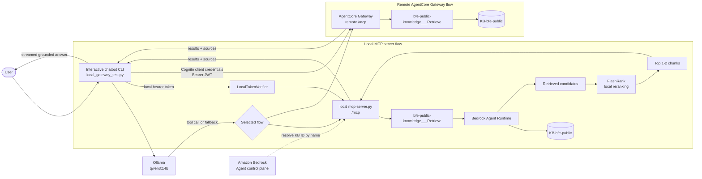

# Open Energy MCP Chatbot

This project provides a local Streamable HTTP MCP server backed by the Amazon Bedrock Knowledge Base `KB-bfe-public`, plus an interactive Ollama chatbot client.

## Purpose
Since the AgentCore Gateway returns a lot of redundant Metadata, local models get overwhelmed with the amount of information they receive. Because of that I introduced a local mcp-server which ranks the results from the KnowledgeBase again according to relevance and only returns the most-relevant information to the model.
The MCP-Server can be adjusted according to the performance of the host machine. (higher performance -> more results)

## Architecture

```text
User
  -> local_gateway_test.py
  -> Ollama qwen3:14b
  -> MCP tools/call
  -> mcp-server.py
  -> Amazon Bedrock Knowledge Base
  -> retrieved passages and source metadata
```

### Component diagram



The control-plane client resolves `KB-bfe-public` to an ID for the local server
when `KNOWLEDGE_BASE_ID` is not configured. The local runtime client retrieves
directly from that Knowledge Base and FlashRank reduces the candidate set before
the compact context is sent back to Ollama. The remote flow is handled by the
Amazon Bedrock AgentCore Gateway and its configured target.

The server retrieves a small candidate set, reranks it locally with FlashRank, and returns only the top one or two passages. The client displays the returned sources after the streamed answer.

## Requirements

- Python 3.14 or a compatible Python environment
- Ollama running locally
- The `qwen3:14b` model installed
- AWS credentials with permission to retrieve from Bedrock Knowledge Bases
- Access to the `KB-bfe-public` Knowledge Base

Install dependencies into the project environment:

```bash
./bin/pip install boto3 flashrank ollama requests
```

Pull the local model if necessary:

```bash
ollama pull qwen3:14b
```

## AWS configuration

Use the normal AWS credential chain where possible:

```bash
export AWS_REGION=eu-central-1
export AWS_PROFILE=your-profile
```

Alternatively, provide credentials through environment variables. Never commit these values:

```bash
export AWS_ACCESS_KEY_ID=...
export AWS_SECRET_ACCESS_KEY=...
export AWS_SESSION_TOKEN=...
```

To skip Knowledge Base name discovery, set the actual Knowledge Base ID:

```bash
export KNOWLEDGE_BASE_ID=your-knowledge-base-id
```

Without `KNOWLEDGE_BASE_ID`, the server searches for the display name `KB-bfe-public` using the `bedrock-agent` control-plane client. Retrieval itself uses `bedrock-agent-runtime`.

## Start the MCP server

The local server uses Streamable HTTP on port 8000:

```bash
export MCP_TRANSPORT=streamable-http
export PORT=8000
./bin/python mcp-server.py
```

The MCP endpoint is:

```text
http://127.0.0.1:8000/mcp
```

## Local authentication

The local server requires a bearer token so that the model-facing flow resembles a protected remote MCP service. The default development token is:

```text
local-development-token
```

Override it consistently for both processes:

```bash
export MCP_DEV_TOKEN=choose-a-development-token
```

This token is used only by the local `mcp-server.py`, which directly targets the
`KB-bfe-public` Knowledge Base. It is not used by the remote gateway.

## Two authentication and retrieval flows

### Remote AgentCore Gateway

Use this flow when `GATEWAY_URL` points to:

```text
https://bfe-energy-knowledge-open-v6rj5uttek.gateway.bedrock-agentcore.eu-central-1.amazonaws.com/mcp
```

The chatbot obtains an Amazon Cognito OAuth 2.0 client-credentials token using
`CLIENT_ID` and `CLIENT_SECRET`. The JWT is sent as a bearer token to the
AgentCore Gateway, which invokes its configured `bfe-public-knowledge` target.
The gateway then accesses `KB-bfe-public`.

### Local MCP server

Use this flow when `GATEWAY_URL` points to:

```text
http://127.0.0.1:8000/mcp
```

`LocalTokenVerifier` is used only by the local `mcp-server.py`. It validates the
development bearer token and then the local server calls the Bedrock APIs
directly against `KB-bfe-public`. No Cognito token is required in this flow.

Do not send the local development token to the remote AgentCore Gateway, and do
not send Cognito client secrets to the local server.

## Start the chatbot

With the local server running in another terminal:

```bash
./bin/python local_gateway_test.py
```

The client defaults to the local endpoint. Select the remote AgentCore Gateway
without editing the Python file:

```bash
export GATEWAY_URL="https://bfe-energy-knowledge-open-v6rj5uttek.gateway.bedrock-agentcore.eu-central-1.amazonaws.com/mcp"
./bin/python local_gateway_test.py
```

The chatbot supports multiple questions in one session. Type `exit`, `quit`, press `Ctrl+C`, or send EOF to stop.

For each question, the client:

1. Sends the question to Ollama with the retrieval tool schema.
2. Uses the model tool call, or a deterministic fallback if the model does not emit one.
3. Displays a waiting status while MCP retrieval runs.
4. Receives the top-ranked passages from the MCP server.
5. Streams the final Ollama answer to the console.
6. Prints source documents, locations, metadata titles, and scores.

## MCP tool contract

The local server exposes the same retrieval contract as the remote gateway. The
client discovers the current remote tool name with `tools/list` at startup, so
renamed AgentCore deployments are supported without changing the client code.

The local server uses:

```text
bfe-public-knowledge___Retrieve
```

Example arguments:

```json
{
  "retrievalQuery": {
    "text": "How has hydroelectric production developed in Switzerland?"
  },
  "top_k": 2
}
```

The response contains the question, Knowledge Base name, selected results, passage text, relevance scores, source locations, and metadata.

## Retrieval and context limits

The server asks Bedrock for `RETRIEVAL_COUNT` candidates, currently 2, then reranks them with FlashRank. `top_k` is limited to 1 or 2. This keeps the context sent to the local 14B model small and reduces prompt prefill time.

The Bedrock Knowledge Base is configured as a managed Knowledge Base, so the Retrieve request uses `managedSearchConfiguration`. Do not combine it with `vectorSearchConfiguration` for this Knowledge Base.

## Failure behavior

Failures are not returned as successful retrievals:

- AWS and Bedrock errors become MCP tool errors.
- JSON-RPC errors and `result.isError` responses raise client exceptions.
- The chatbot prints the MCP error and skips answer generation for that question.
- The user is returned to the next `You:` prompt.

Typical checks:

```bash
./bin/python -m py_compile mcp-server.py local_gateway_test.py
```

If authentication fails, verify that `MCP_DEV_TOKEN` is identical in the server and client environments. If Knowledge Base lookup fails, configure `KNOWLEDGE_BASE_ID` and verify AWS permissions and region.

## Remote gateway mode

To use the remote AgentCore Gateway, set `GATEWAY_URL` to the remote `/mcp` URL
and provide:

```bash
export CLIENT_ID=...
export CLIENT_SECRET=...
```

The remote gateway has its own Cognito authentication and MCP headers. The
local `LocalTokenVerifier` is not involved in this flow.
