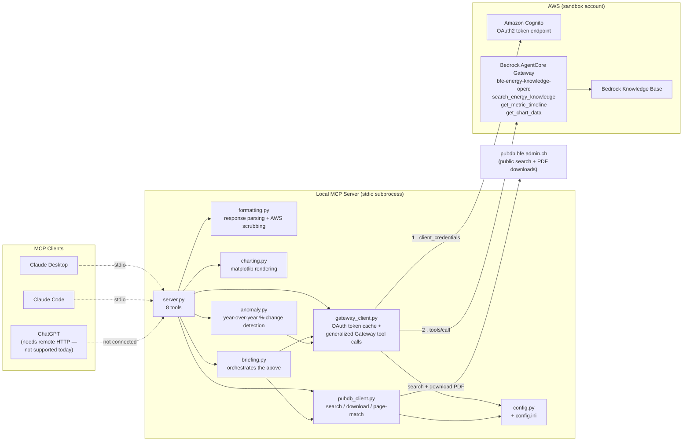
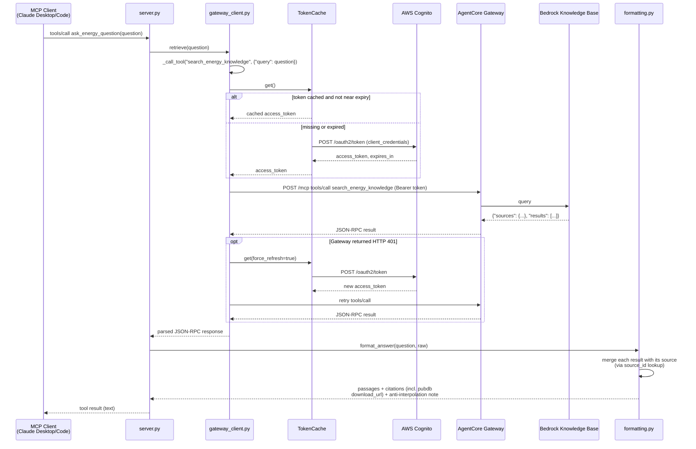
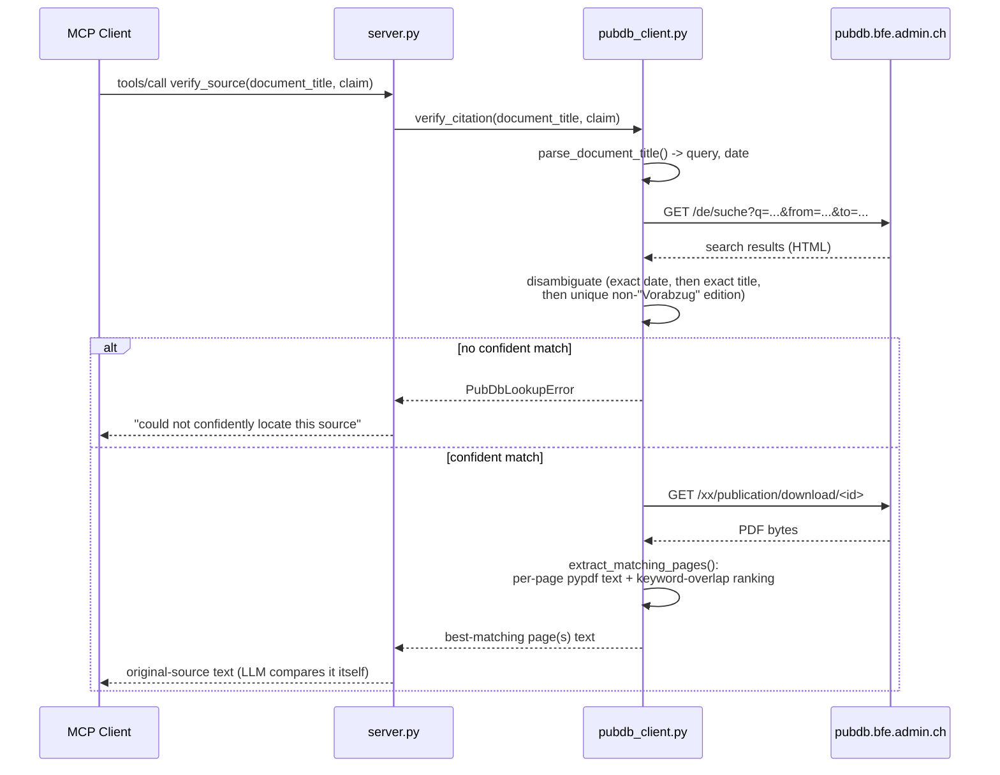

# Architecture

## Overview

This MCP server sits between a local LLM client (Claude Desktop, Claude Code) and two
external systems:

1. **AWS Bedrock AgentCore Gateway** — a managed MCP-over-HTTP endpoint, secured by
   Cognito OAuth2 client-credentials, wrapping a Bedrock Knowledge Base built from ~5GB of
   public SFOE PDFs. It exposes three native tools this server calls: `search_energy_knowledge`
   (backs `ask_energy_question`), `get_metric_timeline`, and `get_chart_data`.
2. **pubdb.bfe.admin.ch** — the SFOE's public publication search/download site, which is
   where those PDFs originally came from. `verify_source` and `get_time_series` fetch the
   *original* PDF here directly, rather than trusting the Knowledge Base's own (sometimes
   OCR-noisy) extraction.

A few design decisions shape the code, and are worth knowing before reading it:

- **Tools return raw fetched material; the calling LLM judges correctness.** None of these
  tools computes a "verified: true/false" verdict itself — `verify_source` and
  `get_time_series` return the actual extracted text of the matching page(s); `render_chart`
  and `explain_anomaly` operate only on numbers the LLM has *already* extracted, never on
  numbers parsed automatically from a PDF/chart. This avoids a brittle deterministic
  correctness-checker and matches how well LLMs already reconcile numbers when given real
  source text.
- **Two independent, deliberately-not-merged verification tiers.** `get_metric_timeline`/
  `get_chart_data` query the knowledge base natively (fast; `get_chart_data` returns real
  structured, parsed chart data with an honest exact/estimated precision flag).
  `get_time_series`/`verify_source` instead download and read the literal original PDF page
  by page (slower, but undeniable ground truth). Both tiers exist on purpose — the fast one
  as a first pass, the literal one to cross-check a specific figure.
- **No AWS/infrastructure details ever reach tool output.** Citations show a publication
  title, a relevance score, and — since the Gateway migration — a real, clickable
  pubdb.bfe.admin.ch download link. Never an S3 URI or `amazonaws.com` domain, even in
  error/fallback paths (`formatting.py` actively scrubs these as defense-in-depth).
- **Secrets vs. configuration are split.** `CLIENT_ID`/`CLIENT_SECRET` live in a gitignored
  `.env`. The Cognito/Gateway/pubdb URLs are not secrets, so they live in a checked-in
  `config.ini`, loaded by `src/energy_gateway_mcp/config.py`.
- **stdio only, today.** The server runs as a local subprocess (`mcp.run()` defaults to the
  `stdio` transport) — see the README for what would be needed to expose it remotely
  (e.g. for ChatGPT).

## Components

| File | Responsibility |
|---|---|
| `server.py` | Defines the 8 MCP tools; catches every custom exception from the client modules and turns it into a friendly string — a single failed call must never crash the server process. |
| `gateway_client.py` | OAuth token fetch/cache (with one forced retry on `401`) behind a generalized `_call_tool(tool_name, arguments)` core, backing three Gateway tools: `search_energy_knowledge`, `get_metric_timeline`, `get_chart_data`. |
| `pubdb_client.py` | Searches pubdb.bfe.admin.ch, disambiguates results (exact date → exact title → unique non-"Vorabzug" edition), downloads PDFs, and ranks pages by keyword overlap (with EN/DE/FR/IT synonym expansion) against a claim. |
| `formatting.py` | Parses the Gateway's `{sources, results}`-shaped responses (and the `get_metric_timeline`/`get_chart_data` variants) into cited, readable text; flags OCR/image-derived and truncated passages; surfaces real pubdb download links; scrubs any AWS/S3 URL as a fallback-path safety net. |
| `charting.py` | Renders a line/bar chart PNG (via matplotlib, `Agg` backend) from numbers already supplied by the caller — no PDF/chart parsing of its own. |
| `briefing.py` | Orchestrates `gateway_client`/`formatting` (narrative) + `pubdb_client` (top-citation verification, optional time series) into one bundled response; every sub-step degrades to an inline note rather than raising. |
| `anomaly.py` | Deterministic year-over-year %-change detection over a caller-supplied series, then one `gateway_client.retrieve` call to look up the anomalous year's narrative. |
| `config.py` / `config.ini` | Non-secret configuration (URLs) — loaded via stdlib `configparser`, resolved relative to the package so it works regardless of the caller's working directory. |

## Sequence: `ask_energy_question`

`get_metric_timeline` and `get_chart_data` follow this identical flow — same token
cache, same `_call_tool` core, same Gateway — differing only in the tool name/arguments
sent and the `formatting` function used to parse the response
(`format_metric_timeline`/`format_chart_data` instead of `format_answer`).

## Sequence: `verify_source` (and `get_time_series`, once per year)

The literal-PDF tier — independent of the Gateway entirely, so it's unaffected by anything
above (this is what kept working the day the Gateway itself was down/recreated).

`get_time_series` runs this exact flow once per year in the requested range (searching
`"<topic> <year>"` each time), aggregating the results into one labeled report; a failure
for one year is caught and reported inline rather than aborting the whole call.

## `render_chart`, `generate_briefing`, `explain_anomaly`

These three don't warrant their own sequence diagrams — they're compositions or pure
functions rather than new network flows:

- **`render_chart`** makes no network call at all. It validates the caller-supplied
  `x_labels`/`series`, renders a PNG with matplotlib, and returns an `Image` (the `mcp` SDK
  converts this to an `ImageContent` block). All the interesting behavior is in what it
  *doesn't* do: no PDF/chart parsing, so no risk of the thousands-grouping ambiguity that
  ruled out an automated version of this.
- **`generate_briefing`** runs the `ask_energy_question` flow above once (for narrative +
  to find the top citation), then the `verify_source` flow once (to cross-check that
  citation), then optionally the `get_time_series` flow (if a series/year range was given)
  — three flows already described above, composed in sequence, each wrapped so a failure in
  one doesn't block the others.
- **`explain_anomaly`** computes the largest year-over-year %-change in a caller-supplied
  series (pure Python, no network), then runs the `ask_energy_question` flow exactly once
  more, with a query built as `f"{topic} {anomalous_year}"`, to fetch the real narrative
  passage about that specific year.
