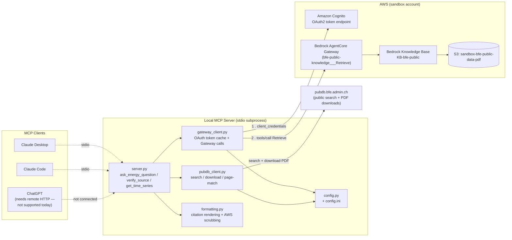
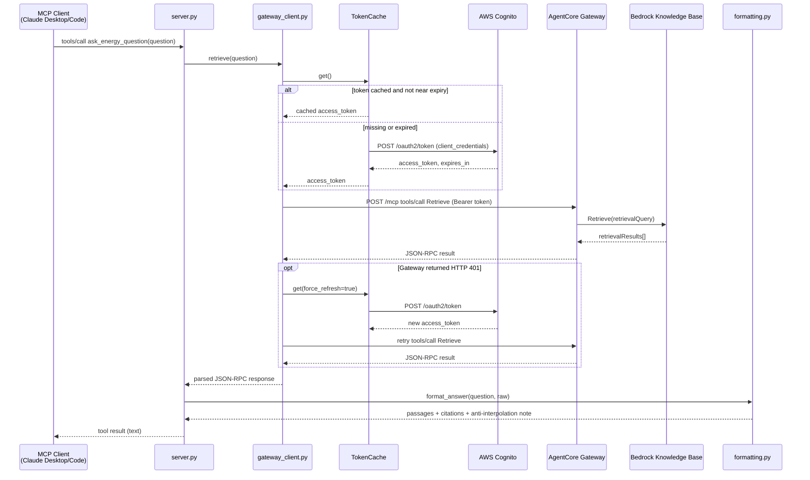
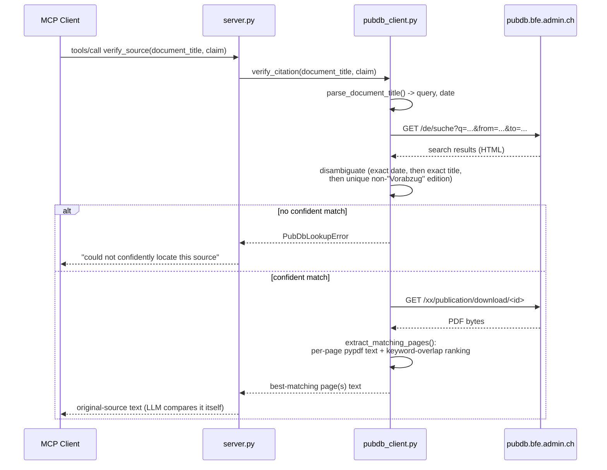

# Architecture

## Overview

This MCP server sits between a local LLM client (Claude Desktop, Claude Code) and two
external systems:

1. **AWS Bedrock AgentCore Gateway** — a managed MCP-over-HTTP endpoint, secured by
   Cognito OAuth2 client-credentials, wrapping a Bedrock Knowledge Base built from ~5GB of
   public SFOE PDFs. This is what `ask_energy_question` calls.
2. **pubdb.bfe.admin.ch** — the SFOE's public publication search/download site, which is
   where those PDFs originally came from. `verify_source` and `get_time_series` fetch the
   *original* PDF here directly, rather than trusting the Knowledge Base's own (sometimes
   OCR-noisy) extraction.

A few design decisions shape the code, and are worth knowing before reading it:

- **Tools return raw fetched material; the calling LLM judges correctness.** None of the
  three tools computes a "verified: true/false" verdict itself — `verify_source` and
  `get_time_series` return the actual extracted text of the matching page(s) and leave the
  comparison to the model. This avoids a brittle deterministic correctness-checker and
  matches how well LLMs already reconcile numbers when given real source text.
- **No AWS/infrastructure details ever reach tool output.** Citations show only a
  publication filename/title and a relevance score — never an S3 URI or `amazonaws.com`
  domain, even in error/fallback paths (`formatting.py` actively scrubs these).
- **Secrets vs. configuration are split.** `CLIENT_ID`/`CLIENT_SECRET` live in a gitignored
  `.env`. The Cognito/Gateway/pubdb URLs are not secrets, so they live in a checked-in
  `config.ini`, loaded by `src/energy_gateway_mcp/config.py`.
- **stdio only, today.** The server runs as a local subprocess (`mcp.run()` defaults to the
  `stdio` transport) — see the README for what would be needed to expose it remotely
  (e.g. for ChatGPT).

## Components

| File | Responsibility |
|---|---|
| `server.py` | Defines the three MCP tools; catches every custom exception from the client modules and turns it into a friendly string — a single failed call must never crash the server process. |
| `gateway_client.py` | OAuth token fetch/cache (with one forced retry on `401`) and the JSON-RPC `tools/call` request to the AgentCore Gateway. |
| `pubdb_client.py` | Searches pubdb.bfe.admin.ch, disambiguates results, downloads PDFs, and ranks pages by keyword overlap (with EN/DE/FR/IT synonym expansion) against a claim. |
| `formatting.py` | Turns a raw Gateway response into cited answer text; flags chart/image-derived (OCR) passages; strips any AWS/S3 URL from output, including in fallback/error paths. |
| `config.py` / `config.ini` | Non-secret configuration (URLs) — loaded via stdlib `configparser`, resolved relative to the package so it works regardless of the caller's working directory. |

## Sequence: `ask_energy_question`

## Sequence: `verify_source` (and `get_time_series`, once per year)

`get_time_series` runs this exact flow once per year in the requested range (searching
`"<topic> <year>"` each time), aggregating the results into one labeled report; a failure
for one year is caught and reported inline rather than aborting the whole call.
