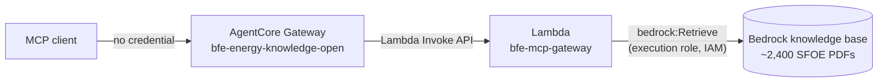

# Open Energy Knowledge Gateway

An open MCP endpoint over ~2,400 public publications of the Swiss Federal
Office of Energy (SFOE/BFE) — reports, studies and statistics in German,
French, Italian and English.

## The setup

The service exposes the SFOE corpus as three MCP tools behind an **open** AWS
AgentCore Gateway: no token, no signup — it publishes public federal documents,
and a credential would only make them harder to read. The gateway forwards each
tool call over the Lambda Invoke API to the `bfe-mcp-gateway` function, whose
execution role allows exactly one thing: `bedrock:Retrieve` against the managed
Bedrock knowledge base built from the PDF collection. Lambda targets do not
speak MCP, so the tool catalogue is not discovered at runtime — it is generated
from the server itself (`mcp-gateway/tool_schema.py`) and uploaded to the
gateway at deploy time. Deployment is two idempotent scripts run in order,
`./infra/deploy-lambda.sh && ./infra/create-gateway.sh` — the function first,
then the gateway that fronts it. All a client needs is this URL:

```text
https://bfe-energy-knowledge-open-v6rj5uttek.gateway.bedrock-agentcore.eu-central-1.amazonaws.com/mcp
```



## Connecting a client

**Claude Code** — this repo ships a `.mcp.json`, so opening the repo is enough.
From any other directory:

```bash
claude mcp add --transport http energy-knowledge \
  https://bfe-energy-knowledge-open-v6rj5uttek.gateway.bedrock-agentcore.eu-central-1.amazonaws.com/mcp
```

**Claude (claude.ai / desktop app)** — *Settings → Connectors → Add custom
connector*, paste the URL as the remote MCP server, leave authentication
empty, and enable the connector in the chat's tools menu. Custom connectors
require a paid plan.

**ChatGPT** — MCP connectors live behind developer mode: *Settings → Apps &
Connectors → Advanced settings → enable Developer mode*, then *Create* a
connector with the URL above and **No authentication**. Available on paid
plans; in a new chat, enable the connector under the developer-mode tools.

The tools appear prefixed with the gateway target name:
`bfe-energy___search_energy_knowledge`, `bfe-energy___get_metric_timeline`,
`bfe-energy___get_chart_data`.

## What the Lambda actually does

The function is the MCP server from [`mcp-gateway/`](mcp-gateway/README.md)
minus the HTTP transport. The gateway does not send it MCP messages — it sends
the tool arguments as the raw event and the tool's name in the invocation's
client context (`bfe-energy___search_energy_knowledge`). The handler
([`lambda_handler.py`](mcp-gateway/lambda_handler.py)) strips the target
prefix and dispatches through the **same `MCPServer.call_tool` path the local
HTTP transport uses**, so argument validation, defaulting and error translation
are byte-for-byte identical whether you run `dev_run.py` on localhost or call
the deployed gateway. Tool failures are *raised*, not returned — that is the
only signal the gateway accepts to mark a call as failed rather than
serving error text as a successful result.

Behind the dispatch, the three tools share one retrieval pipeline: call
Bedrock `Retrieve`, deduplicate near-identical chunks, rank, attach source
attribution with public download URLs, and annotate each passage with what its
numbers measure, which years they cover, and whether they are projections or
were cut off mid-chunk.

### The optimizations, and why

- **Reserved concurrency 5.** The gateway is open, so there is no per-caller
  identity and no per-caller brake; this cap is the only thing between a
  client's retry loop and the Bedrock bill. `./infra/deploy-lambda.sh --pause`
  drops it to 0 — a one-command kill switch.
- **One event loop, created at import.** The server is async; the handler is
  not. A module-level loop is reused across warm invocations, so the MCP
  server, the boto client and its connection pool all survive between calls
  instead of being rebuilt per request.
- **Over-fetch 50, deduplicate, then truncate.** Bedrock's default of 5
  passages came from a mean of 3.4 distinct documents (48% from a single one,
  measured over 12 multilingual questions). Fetching 50 and deduplicating
  *before* cutting to `max_results` returns the same number of passages from
  meaningfully more documents.
- **Small responses by default.** Sources are interned into one table and
  referenced by `source_id` per passage; timelines default to an index-level
  detail. Responses land in an agent's context window, and every repeated
  URL or full passage is context the agent can't spend on reasoning.
- **512 MB on arm64.** The working set is 53–76 MB; the memory buys CPU,
  because Lambda scales CPU with memory and the cold start is CPU-bound.
  arm64 because Lambda runs Graviton natively and it is cheaper per ms.
- **Tight boto timeouts inside the 60 s budget.** 15 s read / 5 s connect with
  3 retries: a slow Bedrock call fails fast enough to be retried within the
  function timeout instead of eating it whole.
- **In-process public-source cache.** Resolving a document to its public
  download URL is cached by document name; the same documents dominate
  successive searches, so the cache absorbs almost all lookups after warm-up.

Why a Lambda *target* instead of the natural MCP-over-HTTP design: AgentCore's
outbound SigV4 signer signs POST bodies as empty, and MCP's streamable-HTTP
transport is POST-only, so every request to an IAM-authorised Function URL dies
on signature verification before the function runs. Invoking the Lambda
directly sidesteps the signer. The price is the static tool catalogue above:
a tool change needs both deploy scripts re-run, in order. Full evidence and
design history in [`mcp-gateway/README.md`](mcp-gateway/README.md).
